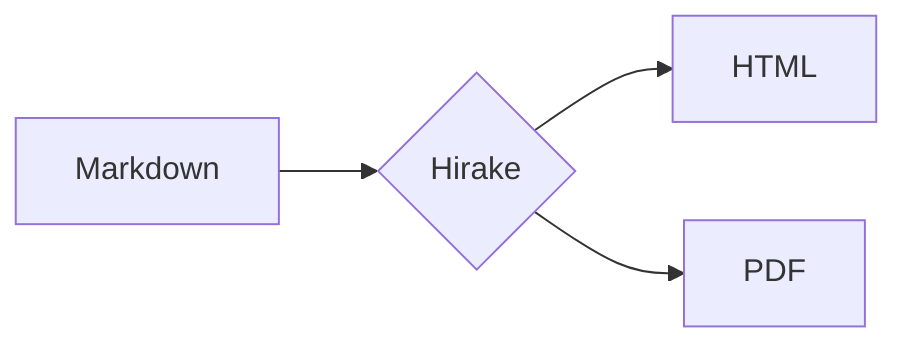

# 新機能テスト文書

10機能の実機検証用ファイルです。

## 数式（KaTeX） $E=mc^2$

インライン数式: 円の面積は $A = \pi r^2$ で求められる。

ブロック数式:

$$
\int_{-\infty}^{\infty} e^{-x^2} \, dx = \sqrt{\pi}
$$

## コードブロック

```csharp
public static string Render(string filePath, string assetsDirectory, string theme = "light")
{
    // テンプレート置換は単一パスで行う
    return Regex.Replace(template, Pattern, m => values[m.Groups[1].Value]);
}
```

## mermaid 図



## テンプレートトークン耐性

本文中のリテラル {{META}} と {{BODY}} はそのまま表示されるべき。

## 表

| 機能 | 状態 |
| --- | --- |
| ダークモード | 検証中 |
| KaTeX | 検証中 |

## 長いセクション

スクロール確認用の本文。あいうえおかきくけこさしすせそ。

### サブセクション A

テキスト。

### サブセクション B

テキスト。
