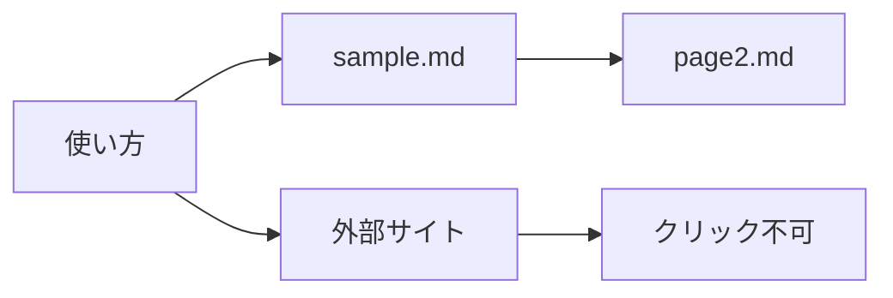

# Mermaid ジャンプのテスト

Mermaid の `click` 記法によるジャンプ機能（#11）の確認用サンプル。
図の各ノードをクリックすると、それぞれ次の動作をする。

| ノード | 期待する動作 |
|---|---|
| 使い方 | 同一文書内の「使い方」見出しへスクロール |
| sample.md | sample.md が新しいタブで開く |
| page2.md | サブフォルダの sub/page2.md が新しいタブで開く |
| 外部サイト | 既定ブラウザで example.com が開く |
| クリック不可 | 何も起きない（従来どおり表示のみ） |

本文の通常アンカーリンクも同じ経路で動作する: [使い方セクションへ](#usage)

## 中間セクション

スクロール動作を確認できるよう、見出しの間に余白を入れている。

- ダミー項目 1
- ダミー項目 2
- ダミー項目 3

## 使い方 {#usage}

ここが「使い方」ノードのジャンプ先。`{#usage}` の明示 ID 指定
（Markdig の GenericAttributes 拡張）を使っているため、
日本語見出しでも ID が安定する。

テーマ切替（Ctrl+Shift+D）で図が再描画された後も、
各ノードのクリックが引き続き機能することを確認する。
