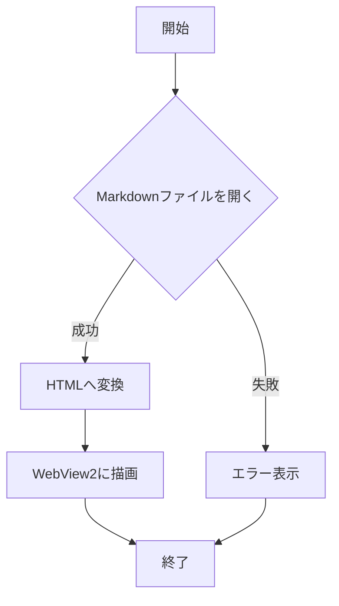

# MdViewer 動作確認用サンプル

このファイルは MdViewer の表示機能を一通り確認するためのテストデータです。見出し・強調・リスト・テーブル・コードブロック・mermaid 図・画像・リンクなどを含みます。

## 目次確認用の見出し

このセクションは目次（TOC）のネスト表示を確認するためのものです。

### 概要

MdViewer は WPF + WebView2 で構築された Markdown ビューアです。

### 特徴

- 高速な表示
- シンタックスハイライト対応
- mermaid 図の描画対応

## テキスト装飾

通常の段落テキストです。改行や折り返しの表示を確認します。**太字のテキスト**と*斜体のテキスト*、そして`インラインコード`を含む一文です。***太字かつ斜体***の組み合わせも確認します。

## リスト

### 箇条書き

- 項目A
- 項目B
  - ネストした項目B-1
  - ネストした項目B-2
- 項目C

### 番号リスト

1. 最初のステップ
2. 次のステップ
3. 最後のステップ

### タスクリスト

- [x] 完了したタスク
- [x] もう一つの完了タスク
- [ ] 未完了のタスク
- [ ] レビュー待ちのタスク

## テーブル

| 項目 | 説明 | 対応状況 |
| --- | --- | --- |
| タブ表示 | 複数ファイルをタブで開く | 対応済 |
| シンタックスハイライト | コードブロックの色分け | 対応済 |
| mermaid | フローチャート等の描画 | 対応済 |
| 目次 | 見出しから自動生成 | 対応済 |

## 引用

> これは引用文のサンプルです。
> 複数行にまたがる引用も確認します。
>
> 段落を分けた引用もここに含まれます。

## 水平線の確認

---

上の行は水平線（`---`）です。

## サブページへの見出し

このセクションでは他ファイルへのリンクと外部リンクを確認します。

## コードブロック

### C# のコード例

```csharp
using System;

namespace MdViewer.Sample
{
    public class Greeter
    {
        public string Greet(string name)
        {
            if (string.IsNullOrWhiteSpace(name))
            {
                throw new ArgumentException("name is required", nameof(name));
            }

            return $"こんにちは、{name} さん！";
        }
    }
}
```

### Python のコード例

```python
def greet(name: str) -> str:
    if not name:
        raise ValueError("name is required")
    return f"こんにちは、{name} さん！"


if __name__ == "__main__":
    print(greet("MdViewer"))
```

## mermaid フローチャート



## 画像

相対パスによる画像埋め込みの確認です。


## リンク

- 外部リンク: [Example Domain](https://example.com)
- 別 Markdown ファイルへのリンク: [サブページ](sub/page2.md)

## まとめ

以上で MdViewer の主要な表示機能（見出し・目次・強調・リスト・テーブル・引用・水平線・コードハイライト・mermaid・画像・リンク）の確認用データは終了です。
